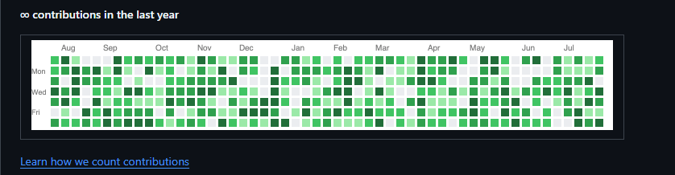

<div align="center">

# 👋 Hi there! I'm Azzaria Alfin (Clawtan)

**Quantitative Systems Engineer • Algorithmic Trader • Low-Latency Builder**

[](https://github.com/Clawtan)
&nbsp;


</div>

---

## 📖 About Me

- 🖥️ **Systems & Quant Engineer**: Designing institutional algorithmic trading engines, low-latency Windows utilities, and automation pipelines.
- 📈 **Full-Time XAUUSD Trader**: Specialized in Michael J. Huddleston's **Inner Circle Trader (ICT)** principles, **Daye 90-Minute Quarterly Theory (AMDX)**, and **Change In State of Delivery (CISD)** execution mechanics (Active since Oct 2016).
- 🎓 **Alumni**: D3 Information Systems, Telkom University.
- ⚙️ **Power User**: Ultra-clean Windows 11 gamer-safe debloat, AdGuard Home (Quad9 DoH), and local-first Obsidian Second Brain knowledge architecture.

---

## ⚡ What I'm Up To

```yaml
Current Focus:
  - Trading: Executing M3 sweet-spot scalping on Gold (XAUUSD) during London & NY AM Killzones
  - Algo Engineering: Refining ICT Quartal Strategy v2.6.0 (Unified HUD & trailing BEP+)
  - MT5 Execution: Automated 1% balance risk calculator & CISD body-level trailing stop EA
  - Systems: Maintaining TabletBridge (C# UHID virtualization) & Vault Guardian (O(1) graph auditor)
```

---

## 🛠️ Tech Stack & Architecture

<table>
  <tr>
    <td align="left" width="200"><b>Algorithmic Trading</b></td>
    <td>
      
      
      
    </td>
  </tr>
  <tr>
    <td align="left"><b>Systems & Automation</b></td>
    <td>
      
      
      
      
    </td>
  </tr>
  <tr>
    <td align="left"><b>Knowledge & Tools</b></td>
    <td>
      
      
      
      
    </td>
  </tr>
</table>

---

## 🏛️ Featured Repositories

- 📈 [**ict-quartal-engine**](https://github.com/Clawtan/ict-quartal-engine) — Modular TradingView suite for Daye 90-minute Quarterly Theory & CISD execution.
- ⚡ [**mql5-trade-manager**](https://github.com/Clawtan/mql5-trade-manager) — MetaTrader 5 execution engine with dynamic 1% risk-lot calculation & Q3 cycle filter.
- 📱 [**tablet-bridge**](https://github.com/Clawtan/tablet-bridge) — Native C# Windows System Tray utility converting Android touch & stylus into UHID tablet input.
- 🛡️ [**win11-debloat-suite**](https://github.com/Clawtan/win11-debloat-suite) — Surgical Windows 11 debloater and 5-tier maintenance suite for competitive gaming rigs.
- 🛡️ [**vault-guardian**](https://github.com/Clawtan/vault-guardian) — Sub-second O(1) graph integrity auditor and cloud conflict eliminator for Obsidian.

---

## 🖥️ Workstation Rig & Environment

```ini
[Primary Hardware Rig]
CPU       = AMD Ryzen 7 9800X3D (8C/16T, 104MB Cache)
GPU       = iGame GeForce RTX 5080 Ultra OC 16GB
Motherboard = Asrock X870E Nova WiFi
RAM       = Corsair 64GB DDR5 6000MT/s CL30
Storage   = Samsung 990 PRO 2TB PCIe 4.0 NVMe
Chassis   = HYTE Y70 Touch Infinite (Integrated 4K Display)

[Operating System & Network]
OS        = Windows 11 Pro 24H2 (Surgically Debloated)
DNS       = AdGuard Home (DoH Quad9 HaGeZi Multi PRO)
Storage   = Proton Drive E2EE Sync + GitHub Private Version Control
```

---

## 📊 GitHub Metrics & Activity

<div align="center">
  
</div>

<br/>

<div align="center">
  
  &nbsp;
  
</div>

---

## 📫 Connect & Reach Out

- **GitHub**: [@Clawtan](https://github.com/Clawtan)
- **Email**: `azzariaalfin@gmail.com`
- **Location**: Ponorogo, East Java, Indonesia
